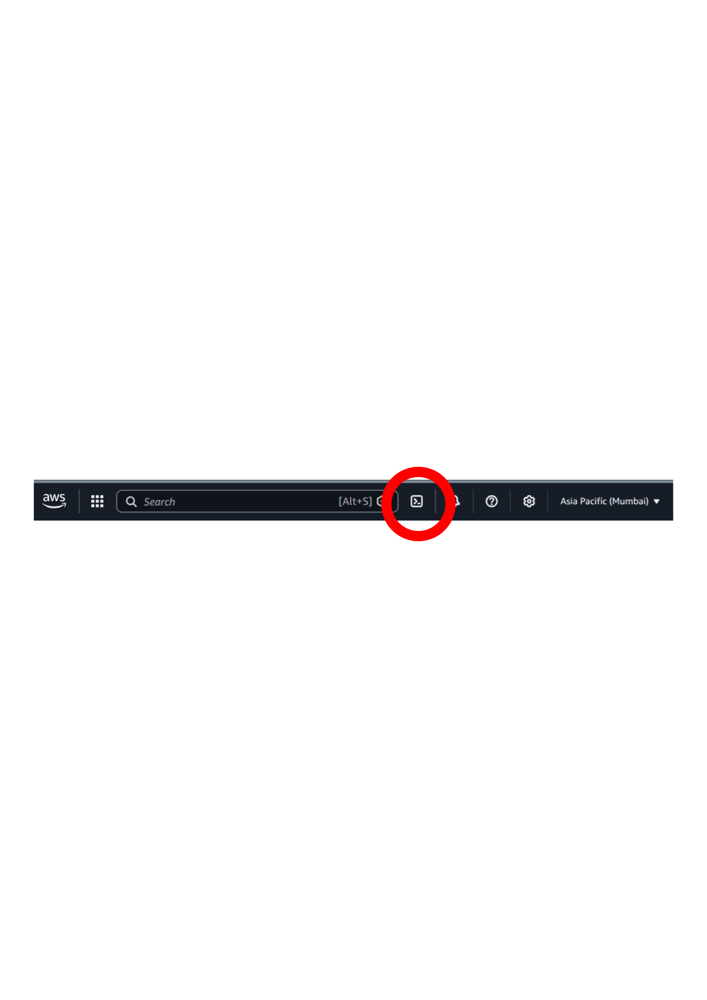

# metal-spot4win

Windows Server 2022 QEMU/KVM dev environment on AWS Linux metal spot instances with WSL2 Ubuntu — for packaging Linux open source software for the Windows ecosystem.

## Quick Start (5 minutes)

### 1. Open AWS CloudShell

Log into the [AWS Console](https://console.aws.amazon.com), then click the CloudShell icon in the top navigation bar:



> CloudShell gives you a terminal with AWS credentials already configured — no setup needed.

### 2. Clone and launch

```bash
git clone https://github.com/labsji/ec2-win22-qemu-spot-metal.git
cd ec2-win22-qemu-spot-metal
bash shazam.sh
```

That's it. In ~5 minutes you'll have a Windows Server 2022 VM with WSL2 Ubuntu, SSH, RDP, Git, Chocolatey, and podman.

### 3. When you're done

```bash
bash shazam.sh down      # stop instance, keep your data (~$20/month for EBS)
bash shazam.sh destroy   # delete EVERYTHING, zero ongoing cost
```

### All commands

| Command | What it does |
|---------|-------------|
| `bash shazam.sh` | Launch (or resume) the dev environment |
| `bash shazam.sh down` | Terminate instance, keep EBS data |
| `bash shazam.sh destroy` | Delete ALL resources (confirms first) |
| `bash shazam.sh ssh` | SSH into the Linux host |
| `bash shazam.sh winssh` | SSH into the Windows VM |
| `bash shazam.sh status` | Show current state |
| `bash shazam.sh cost` | Show running costs |

## Why?

- Windows metal instances (e.g., `i3en.metal`) cost ~$5/hr in Mumbai
- Linux metal instances (e.g., `c5.metal`) cost ~$1.5/hr as spot
- This project runs Windows Server 2022 as a QEMU/KVM VM on Linux metal spot instances
- WSL2 inside Windows provides the Linux environment for building/packaging software
- Persistent EBS volume survives spot terminations — no data loss

## Architecture

```
┌─────────────────────────────────────────────┐
│  AWS c5.metal spot instance (ap-south-1a)   │
│  Ubuntu 24.04 + QEMU/KVM                    │
│                                             │
│  ┌─────────────────────────────────────┐    │
│  │  Windows Server 2022 (QEMU VM)      │    │
│  │  - Activated (ServerStandard)       │    │
│  │  - SSH (port 2222), RDP (3389)      │    │
│  │  - Git, Chocolatey                  │    │
│  │  ┌─────────────────────────────┐    │    │
│  │  │  WSL2 Ubuntu                │    │    │
│  │  │  Kernel 6.6.87             │    │    │
│  │  │  (your dev environment)    │    │    │
│  │  └─────────────────────────────┘    │    │
│  └─────────────────────────────────────┘    │
│                                             │
│  250GB EBS (persistent across spot cycles)  │
│  /var /usr /opt /data                       │
└─────────────────────────────────────────────┘
```

## What you get

- Windows Server 2022 (activated, latest build)
- SSH, RDP access
- Chocolatey, Git
- WSL2 Ubuntu 24.04 with kernel 6.6.87
- Podman + podman-compose for running containerized Linux applications
- Dev tools: gcc, python3, aws-cli, jq, curl

## Prerequisites

1. AWS account with ap-south-1 (Mumbai) access
2. AWS CloudShell (recommended) or any machine with AWS CLI configured
3. Spot vCPU quota of at least 96 for c5.metal ([request increase](https://console.aws.amazon.com/servicequotas))

## Accessing the environment

### SSH into Windows

```bash
bash shazam.sh winssh
# Password: see secrets/admin-password.txt
```

### RDP

Connect your RDP client to `<IP>:3389` (IP shown after `bash shazam.sh`).

### VNC

```bash
ssh -L 5900:localhost:5900 -i ~/.ssh/shazam-* ubuntu@<IP>
# Then connect VNC client to localhost:5900
```

## Cost

| Resource | Cost | When |
|----------|------|------|
| c5.metal spot | ~$1.50/hr | Only while running |
| 250GB EBS | ~$20/month | Always (until `destroy`) |

Run `bash shazam.sh cost` to see current prices.

## Technical details

See [DESIGN.md](DESIGN.md) for:
- Unattended Windows install (autounattend.xml)
- Two-phase setup.ps1 (DISM activation, WSL2, Windows Update)
- QEMU configuration
- Troubleshooting
- Exposing WSL2 services to LAN
