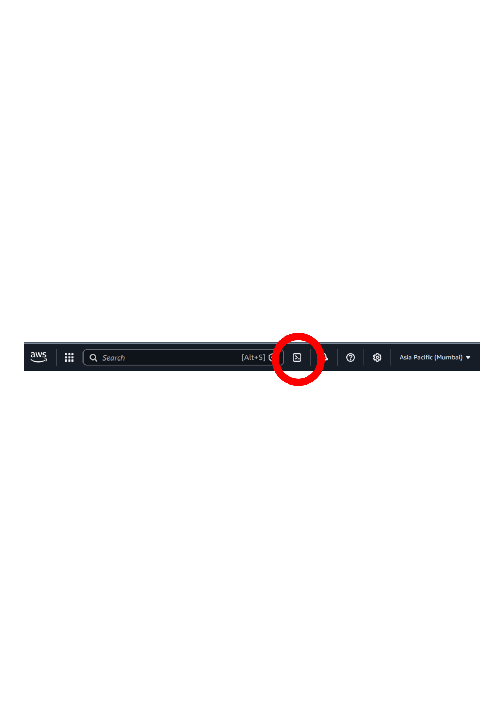

# metal-spot4win

Multi-VM Windows dev environment on AWS metal spot instances — for packaging and testing Linux open-source software (ERPNext, Frappe) as Windows installers.

## Quick Start

### 1. Open AWS CloudShell

Log into the [AWS Console](https://console.aws.amazon.com), then click the CloudShell icon in the top navigation bar:



### 2. Clone and launch

```bash
git clone https://github.com/labsji/ec2-win22-qemu-spot-metal.git
cd ec2-win22-qemu-spot-metal
bash shazam.sh up ikuku
```

Boots from the latest snapshot in ~5 minutes. Multiple VMs supported.

### 3. When you're done

```bash
bash shazam.sh down      # snapshot + terminate (zero ongoing compute cost)
bash shazam.sh destroy   # delete EVERYTHING including snapshots
```

## Commands

| Command | What it does |
|---------|-------------|
| `bash shazam.sh up [vm1,vm2]` | Launch instance, create volumes from snapshots, boot VMs |
| `bash shazam.sh down` | Snapshot all → terminate → delete volumes |
| `bash shazam.sh ssh` | SSH into Linux host |
| `bash shazam.sh winssh <vm>` | SSH into a Windows VM |
| `bash shazam.sh status` | Show instance + snapshot state |
| `bash shazam.sh cost` | Show running costs |
| `bash shazam.sh snapshot <vm> [label]` | Manual checkpoint snapshot |
| `bash shazam.sh clone <src> <dst>` | Clone a VM (snapshot → new VM name) |
| `bash shazam.sh install <vm>` | Fresh Windows install on empty VM |
| `bash shazam.sh list` | List all VM snapshots |
| `bash shazam.sh destroy` | Delete ALL resources (confirms first) |

## Architecture (v2)

```
┌─────────────────────────────────────────────────────────────────┐
│  AWS m5d.metal spot instance (ap-south-1a)                      │
│  Ubuntu 24.04 + QEMU/KVM                                       │
│                                                                 │
│  /data (EBS vol, LABEL=data)        ← ISOs, shared tools       │
│  /vm/ikuku (EBS vol, LABEL=win-ikuku)    ← QCOW2 + state       │
│  /vm/prospect (EBS vol, LABEL=win-prospect) ← QCOW2 + state    │
│                                                                 │
│  ┌────────────────────┐  ┌────────────────────┐                 │
│  │ VM: ikuku          │  │ VM: prospect       │                 │
│  │ SSH:2222 RDP:3389  │  │ SSH:2223 RDP:3390  │                 │
│  │ VNC:5900           │  │ VNC:5901           │                 │
│  │ Windows Server 2022│  │ Windows Server 2022│                 │
│  │ + WSL2 + podman    │  │ (clean prospect)   │                 │
│  └────────────────────┘  └────────────────────┘                 │
└─────────────────────────────────────────────────────────────────┘
```

### Key Principles

1. **Snapshots are truth, volumes are ephemeral.** On `up`: create volumes from snapshots. On `down`: snapshot + delete volumes. Spot reclaim? Create new volumes from snapshot, launch new instance.

2. **One filesystem per volume.** No partitions. Each volume = one ext4 with a LABEL. No data loss from force-detach.

3. **Multi-VM via separate volumes.** Each Windows VM gets its own EBS volume. Port mapping is slot-based (VM index determines SSH/RDP/VNC ports).

## Why?

**Why metal instances?** Regular EC2 instances can't run nested hypervisors. Metal gives bare-metal access with VT-x — QEMU runs Windows at near-native speed.

**Why Linux hosting Windows?** AWS Windows metal = ~$5/hr. Linux metal spot = ~$0.78/hr. 85% cheaper.

**Why the nesting (Linux → Windows → WSL2 → Linux)?** We're testing Windows installers that set up WSL2 + podman for end users. This mirrors exactly what a prospect's machine looks like.

**Why spot?** Metal is expensive. Spot saves 60-80%. Snapshots survive spot terminations — zero data loss.

## Snapshot Library

The system maintains a library of VM snapshots at logical points:

| Snapshot | Content | Use case |
|----------|---------|----------|
| `win22-fresh` | Just installed, no updates, no WSL | Test installer from scratch |
| `win-base` | Updated + WSL2 + podman | Test with WSL already present |
| `ikuku-full-working` | Full ikuku installed + Kiro | Quick resume, regression |
| `data-isos` | Windows + VirtIO ISOs | New VM installs |

Clone any snapshot to create disposable test VMs:
```bash
bash shazam.sh clone win-base prospect    # 30 seconds
bash shazam.sh up prospect                # boot the clone
# test... trash it... clone again
```

## Cost

| Resource | Cost | When |
|----------|------|------|
| m5d.metal spot | ~$0.78/hr | Only while running |
| Snapshots | ~$0.05/GB/mo actual data | Always |
| Typical idle (5 snapshots) | ~$5/month | Snapshots only |

**No ongoing compute cost when stopped.** Only snapshot storage.

## Prerequisites

1. AWS account with ap-south-1 (Mumbai) access
2. AWS CloudShell (recommended) or any machine with AWS CLI
3. Spot vCPU quota of at least 96 ([request increase](https://console.aws.amazon.com/servicequotas))

## Accessing VMs

```bash
bash shazam.sh ssh              # Linux host
bash shazam.sh winssh ikuku     # Windows VM (port 2222)
bash shazam.sh winssh prospect  # Second VM (port 2223)
```

RDP: `<IP>:3389` (first VM), `<IP>:3390` (second VM)

## First-Time Setup

If no snapshots exist (fresh start):

```bash
bash shazam.sh up ikuku         # creates fresh volumes, downloads ISOs
bash shazam.sh install ikuku    # installs Windows (~30 min, unattended)
bash shazam.sh snapshot ikuku   # save the golden image — never rebuild
```

## Technical Details

See [DESIGN.md](DESIGN.md) for:
- Snapshot-as-persistence lifecycle
- Multi-VM port mapping
- Cloud-init volume detection
- QEMU configuration
- Spot reclamation handling (spec)
- Win11 with software TPM (swtpm)

## Credits

Co-created with [Kiro](https://kiro.dev) — from spot instance orchestration to snapshot management, every script was pair-programmed in `kiro-cli`.
